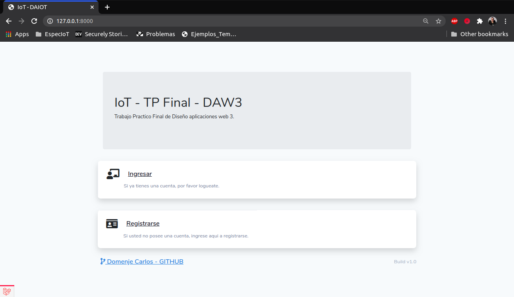
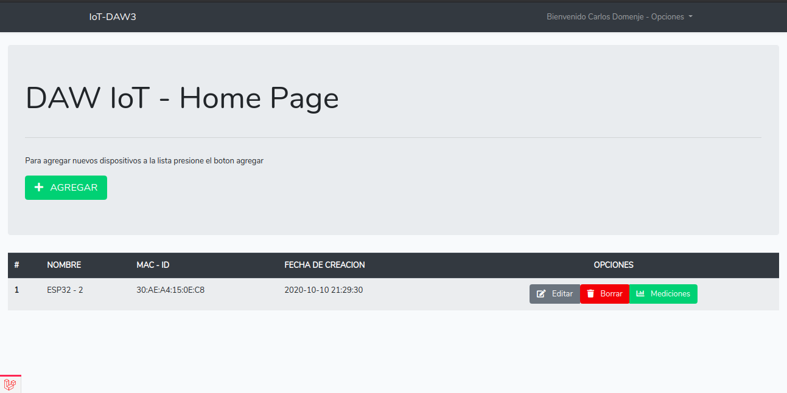
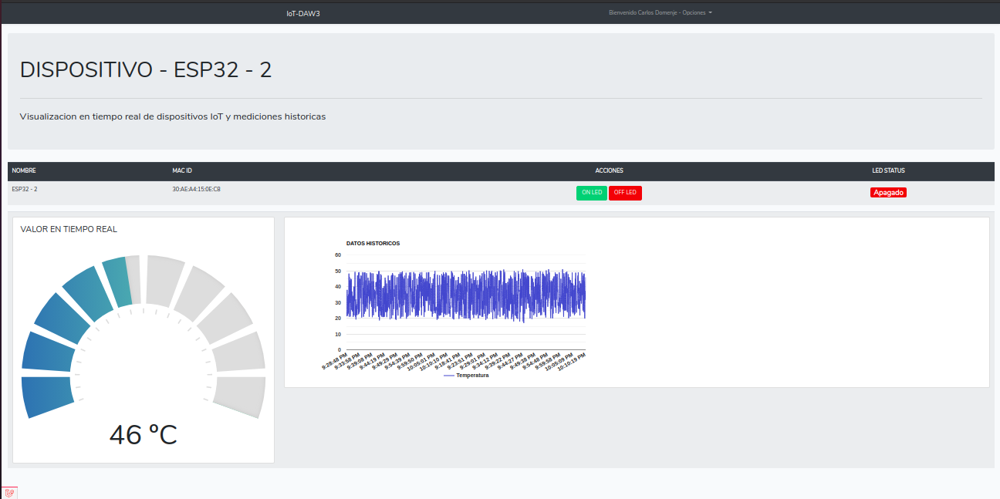
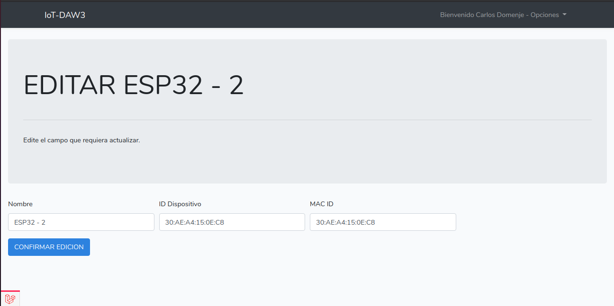

Autor: Domenje Carlos R. - 2020

# TP DAW IoT

Proyecto Final Diseño Aplicaciones Web IoT

## Introduccion 🚀

Este proyecto se realizo como parte del trabajo practico final de la catedra Diseño de aplicaciones web para Internet de las Cosas.

Este trabajo consiste en diseñar una aplicacion que muestre un listado de sensores que estan alojados en una base de datos. 

Ademas, debe tener la posibilidad de ingresar a cada sensor y ver su historial de mediciones y en tiempo real, crear nuevos sensores o bien editar los mismos


Mira **Despliegue** para conocer como desplegar el proyecto.


### Pre-requisitos 📋

[NodeJs](https://nodejs.org/es/download/) Para la realizacion del cliente MQTT que aloja los datos en MySQL.
[Npm](https://docs.npmjs.com/cli/install) Para realizar la instalacion de paquetes utilizacion por la aplicacion.
[Laravel](https://laravel.com/docs/8.x/installation) Para realizar el backend de la aplicacion.
[Vue](https://es.vuejs.org/v2/guide/installation.html) Para realizar el frontend de la aplicacion.


Guia de instalacion en Ubuntu 18,17,16 y 14


[Git](https://git-scm.com/book/en/v2/Getting-Started-Installing-Git) es necesario si quiere realizar por linea de comandos el clone del repositorio.

Descargar o clonar el repositorio del proyecto.
```
git clone https://github.com/carlosdomenje/tp_final_dawIOT.git

```

## Despliegue 📦

Para realizar el despliegue de la aplicacion primero debera ingresar a la carpeta del proyecto:

```
cd tp_final_dawIOT
```
Primero ingresar a la carpeta 
```
cd iot_tp_web
```
Abrir una terminal y ejecutar:

```
composer install
npm install

php artisan serve
```
Abrir otra Terminal, dirigirse a la carpeta node_app_mqtt_client, instalar dependencias necesarias y ejecutar el comando de nodemon para ejecutar la aplicacion.

```
nodemon index.js

```
Abrir el navegador web e ingresar la siguiente URL:

```
http://localhost:8000
```


## Captura de la aplicacion 📳️






## Herramientas utilizadas 🛠️

* [NodeJS](https://nodejs.org/en/)
* [MySQL](https://www.mysql.com/) 
* [phpMyAdmin](https://www.phpmyadmin.net/)


## Contribuir 🖇️

Puede contribuir realizando un pull request con las sugerencias al proyecto.


## Versionado 📌

Se utiliza [Git](https://git-scm.com/) para el versionado.


## Licencia 📄

Este proyecto está bajo la Licencia GPL.

